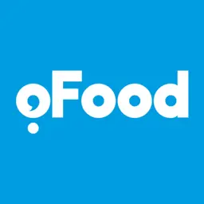

<div align="center">
  <a href="https://github.com/always-maap/oFood-Assignment">
    
  </a>

  <p>oFood Software engineer Assignment - Spring 2024</p>
</div>

## About

This project is about handling user reviews and aggregating the result. The project is part of oFood 2024 spring interview process for Software engineer role.

## Architecture

The project is following Clean architecture, Domain-Driven Design, and CQRS principles.
The aggregation of reviews are handled by a separate worker.
It's an express.js application which uses Swagger to generate documentation and problem-details to report the errors.

## Technologies

- Node.js
- TypeScript
- Express.js
- MySQL
- Redis
- Drizzle ORM
- Swagger
- Problem details
- Zod

## Setup

First, use docker-compose to run the needed services:

```
docker compose up -d
```

then install the dependencies and run the applications:

```
pnpm install
pnpm dev
pnpm worker:dev
```

Open http://localhost:8080/docs to view the swagger documentation.
